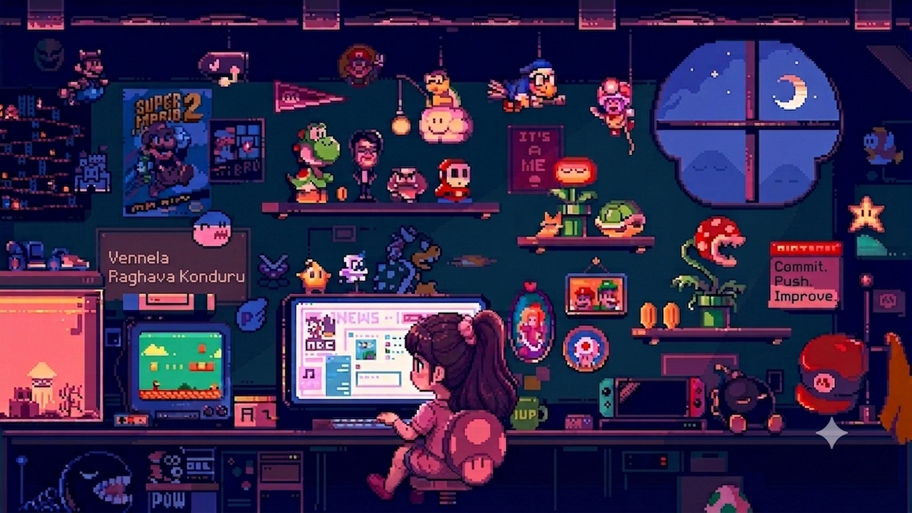

  

<h1 align="center">Hi 👋, I'm Vennela Konduru</h1>

<h3 align="center">
  🚀 Aspiring Software Engineer | AI & Data Science Student | Building Solutions with Purpose
</h3>

---

  
  
  

  I am a Computer Science student dedicated to bridging the gap between artificial intelligence and robust software engineering. I enjoy building real-world software solutions, tackling complex problems, and exploring emerging tech stacks.

---

## 🚀 About Me & Journey

* 🎓 **Education:** B.Tech CSE (Artificial Intelligence & Data Science)
* 🧠 **Focus Areas:** Deep Learning, Machine Learning & Intelligent Application Development
* 🌐 **Core Skills:** Software Engineering, Full-Stack Development & System Architecture
* 🔐 **Interests:** Cloud Infrastructure Security & Cybersecurity Concepts
* 📊 **Problem Solving:** Data Structures & Algorithms
* 💡 **Motto:** *"Code with curiosity. Build with purpose. Learn without limits."*
* 🤝 **Goal:** Open to collaborating on innovative open-source projects!

---

## 🛠️ My Tech Stack

  

---

## 🎮 Contribution Animations

### 👾 Pac-Man Contribution Labyrinth

  

### 🐍 Snake Eating Contributions (Light Mode)

  

### 🌌 Snake Game (Dark Mode)

  

---

## 📈 Activity Stats

  
  

